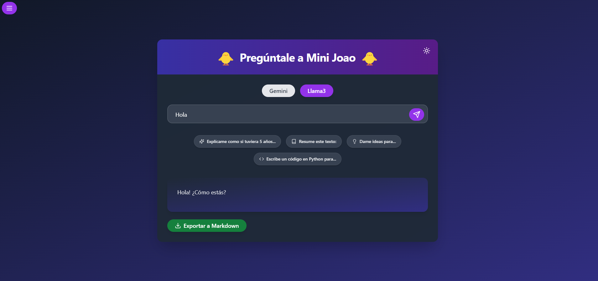

# AI Chat Interface


## 🌟 Overview

This sophisticated web application enables users to interact with two advanced AI models: Gemini (Chrome) and Llama3. Featuring a robust backend server and a responsive frontend React application, it provides a seamless and intuitive user experience for AI-powered conversations. The interface can be accessed from any device on the local network, making it versatile and convenient for various use cases.

## 🚀 Features

- 💬 Interactive and user-friendly chat interface
- 🧠 Dual AI model support: Gemini (Chrome) and Llama3
- 🌓 Dynamic theme switching between light and dark modes
- 💡 Curated set of common prompt suggestions for quick interactions
- 📜 Comprehensive conversation history management
- 📤 One-click export of conversations to Markdown format
- 📱 Responsive design for various screen sizes
- 🌐 Accessible from any device on the local network

## 🖼️ Interface Images




## 📋 Requirements

### Backend

- Node.js (v14 or later)
- npm (v6 or later)
- Chrome Canary (for Gemini AI)
- Llama3 server (for Llama3 AI). If not installed, follow the instructions at [ollama](https://github.com/ollama/ollama).

### Frontend

- Node.js (v14 or later)
- npm (v6 or later)
- Modern web browser (Chrome, Firefox, Safari, or Edge)

## 🛠️ Installation and Configuration

### Backend Setup

1. Navigate to the `backend` folder:
   ```bash
   cd backend
   ```

2. Install required dependencies:
   ```bash
   npm install
   ```

3. Configure the `server.js` file:
   - Set `serverIP` to your machine's local IP address (e.g., '192.168.1.100')
   - Adjust `userDataDir` and `executablePath` to match your Chrome Canary installation path

4. Start the backend server:
   ```bash
   node server.js
   ```

### Frontend Setup

1. Navigate to the `frontend` folder:
   ```bash
   cd frontend
   ```

2. Install required dependencies:
   ```bash
   npm install
   ```

3. Update `src/AIPromptApp.js`:
   - Replace the IP address in `serverURL` with your machine's local IP address
   - Example: `const serverURL = 'http://192.168.1.100:3001';`

4. Start the frontend development server:
   ```bash
   npm start
   ```

### Chrome Canary Configuration for Gemini Nano

1. Download and install [Chrome Canary](https://google.com/chrome/canary/) (version 127 or later)

2. Enable flags:
   - `chrome://flags/#prompt-api-for-gemini-nano`: Set to "Enabled"
   - `chrome://flags/#optimization-guide-on-device-model`: Set to "Enabled BypassPerfRequirement"

3. Restart Chrome Canary

4. Check `chrome://components/` for "Optimization Guide On Device Model"
   - Ensure model is fully downloaded (Version should be like "2024.6.5.2205")

5. If "Optimization Guide On Device Model" is missing:
   - Add "English" in `chrome://settings/languages` and set as display language
   - Restart Chrome Canary and check again

6. Verify setup in console:
   ```javascript
   window.ai
   const model = await window.ai.createTextSession();
   await model.prompt('Who are you?');
   ```

## 🖥️ Usage

1. Ensure both backend and frontend servers are running on your host machine
2. Access the application:
   - Host machine: `http://localhost:3000`
   - Other devices: `http://<host-machine-ip>:3000`
3. Select AI model: Gemini or Llama3
4. Enter prompt and submit
5. View AI response and continue conversation
6. Use sidebar for conversation history management
7. Export conversation to Markdown for sharing or documentation

## 🌐 Network Access

- Accessible from any device on your local network
- Open `http://<host-machine-ip>:3000` on other devices
- Ensure host machine's firewall allows incoming connections on ports 3000 and 3001

## 🔧 Troubleshooting

- Verify Chrome Canary installation and configuration for Gemini AI issues
- Check Llama3 server accessibility for Llama3 AI problems
- Confirm IP address configurations in frontend and backend
- Check host machine's firewall settings
- Ensure all devices are on the same local network

## 📄 License

This project is licensed under the GNU License - see the [LICENSE](LICENSE) file for details.

## 🙏 Acknowledgments

Thanks to the Gemini and Llama3 teams for their amazing AI models.

## 🆘 Support

For questions or assistance, please open an issue in the GitHub repository or contact the maintainers directly.

---

Happy chatting with AI from any device on your network! 🤖💬🌐
